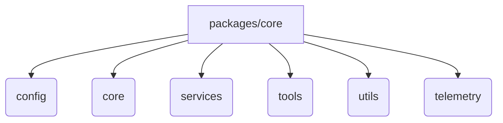
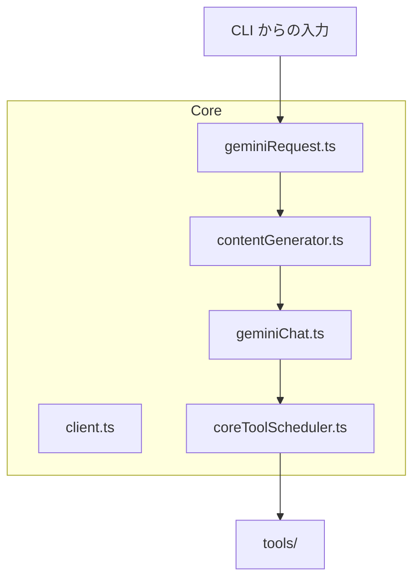
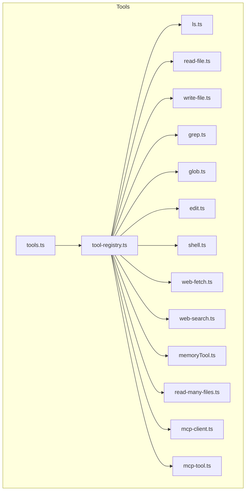
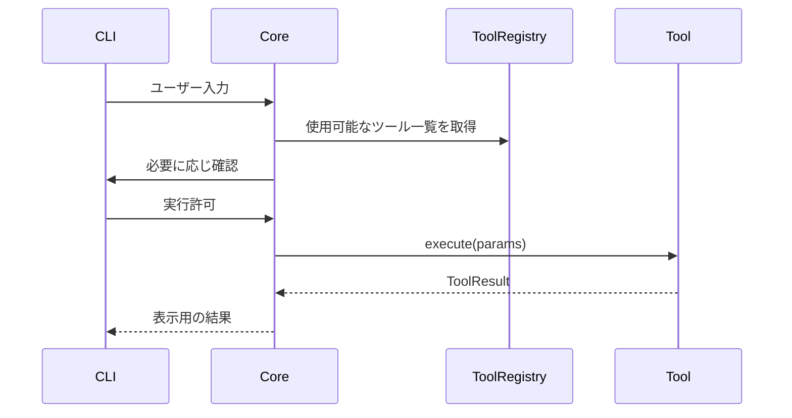

# packages/core と packages/core/src/tools のファイル構成

このドキュメントでは、Gemini CLI の **core** パッケージ (`packages/core`) と
その配下にある **tools** ディレクトリ (`packages/core/src/tools`) の主要ファイルの
役割と相互関係を解説します。

## ディレクトリ構成

- **config**: 設定読み込みやモデル名定義を行う。
- **core**: Gemini API とのやり取りやチャット管理ロジックを含む。
- **services**: ファイル探索や Git 連携など補助サービス群。
- **tools**: ツールの定義と実装。
- **utils**: 各種ユーティリティ関数。
- **telemetry**: ログ出力やセッション管理。

## コア機能の関係

- **client.ts**: API 呼び出し用の基本クラス。
- **geminiRequest.ts**: CLI からのリクエストを処理し、`contentGenerator`へ渡す。
- **contentGenerator.ts**: プロンプト生成や API 呼び出し設定を担当。
- **geminiChat.ts**: チャット履歴管理と応答の整形。
- **coreToolScheduler.ts**: モデルから要求されたツール呼び出しを調整する。

## tools ディレクトリ

- **tools.ts**: `BaseTool` や `Tool` インターフェースなど、ツール実装の基底となる定義を提供。
- **tool-registry.ts**: ツールの登録・発見・取得を管理するクラス。
- **ls.ts** など各種ファイルは具体的なツールの実装。
- **mcp-client.ts / mcp-tool.ts**: MCP サーバーから取得したツールを扱うためのロジック。

## ツール呼び出しの流れ

各ツールは `BaseTool` を継承し、`execute()` メソッドで処理を実装します。
`ToolRegistry` は利用可能なツールを管理し、モデルからのリクエストに応じて
対象ツールを呼び出します。

