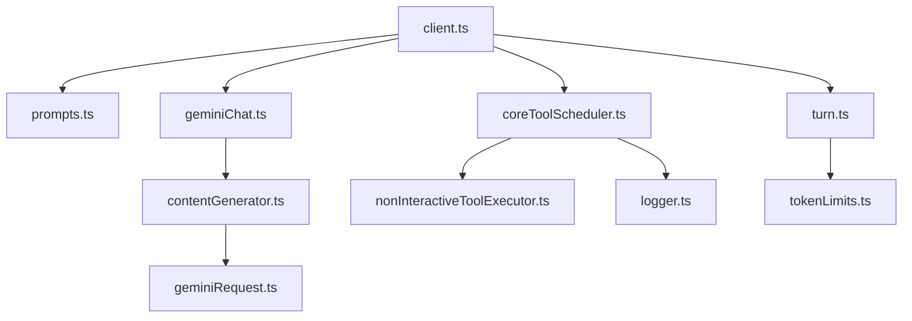

# Core と Tools のファイル構成

このドキュメントでは `packages/core` 内の主要なソースコードの役割と、
`src/core` と `src/tools` フォルダにおけるファイル間の関係を説明します。
Mermaid 図を用いて構造を視覚化します。

## src/core 配下

以下の図は `src/core` フォルダの主なファイル同士の依存関係を示しています。


- **client.ts**: CLI からのリクエストを受け取り、Gemini API とのやり取りや
  ツールのスケジュールを行うエントリーポイントです。
- **geminiChat.ts**: Google の `@google/genai` ライブラリをラップし、
  チャット形式でのメッセージ送受信を担います。
- **contentGenerator.ts**: ストリーム処理や再試行制御など、
  API 呼び出しの細かな挙動を管理します。
- **geminiRequest.ts**: モデルへ送るリクエストの型や変換処理を提供します。
- **coreToolScheduler.ts**: モデルから要求されたツール呼び出しを
  キュー管理し、実行可否の確認や結果の取りまとめを行います。
- **nonInteractiveToolExecutor.ts**: CLI の対話なしで単一ツールを実行する際に使用します。
- **prompts.ts**: モデルへ渡すシステムプロンプトや履歴圧縮用プロンプトを生成します。
- **turn.ts**: チャットの各ターンを表す型やイベント定義を保持します。
- **tokenLimits.ts**: モデルごとのトークン上限値を定義します。
- **logger.ts**: コア内部で使用するロギングのヘルパーです。

## src/tools 配下

次の図では `src/tools` に含まれる主なクラスとツール実装の関係を示します。
```mermaid
flowchart TD
    ToolBase[tools.ts]
    Modifiable[modifiable-tool.ts]
    Registry[tool-registry.ts]
    MCPClient[mcp-client.ts]
    MCPT["mcp-tool.ts"]

    ToolBase <|-- Modifiable
    Registry --> ToolBase
    Registry --> MCPClient
    MCPClient --> MCPT

    Modifiable <|-- EditTool[edit.ts]
    Modifiable <|-- WriteFile[write-file.ts]
    ToolBase <|-- ReadFile[read-file.ts]
    ToolBase <|-- LSTool[ls.ts]
    ToolBase <|-- GrepTool[grep.ts]
    ToolBase <|-- GlobTool[glob.ts]
    ToolBase <|-- ShellTool[shell.ts]
    ToolBase <|-- WebFetch[web-fetch.ts]
    ToolBase <|-- WebSearch[web-search.ts]
    ToolBase <|-- ReadManyFiles[read-many-files.ts]
    ToolBase <|-- MemoryTool[memoryTool.ts]
```

- **tools.ts**: すべてのツールが実装すべきインターフェース `Tool` と
  基底クラス `BaseTool` を定義します。またツール結果用の `ToolResult` 型を提供します。
- **modifiable-tool.ts**: ファイルを書き換えるツール向けの共通処理
  （エディタ起動や差分取得など）を実装したクラスです。`edit.ts` や `write-file.ts`
  がこのクラスを継承しています。
- **tool-registry.ts**: 内蔵ツールや発見したツールを登録・管理します。
  CLI からはここを経由してツール定義を取得します。
- **mcp-client.ts / mcp-tool.ts**: MCP(Model Context Protocol) サーバーと通信し、
  外部提供ツールを登録するための仕組みです。
- **各ツール実装**: ファイル操作 (`read-file.ts`, `write-file.ts` など)、
  シェル実行 (`shell.ts`)、Web 操作 (`web-fetch.ts`, `web-search.ts`)、
  複数ファイル読み込み (`read-many-files.ts`)、メモリ保存 (`memoryTool.ts`) など、
  具体的な機能を `BaseTool` または `ModifiableTool` として実装しています。

## まとめ

`packages/core` は CLI からのリクエストを処理し、Gemini API への問い合わせや
ツール呼び出しを統括するバックエンドです。`src/core` ではリクエストの
組み立て・履歴管理・ツール実行のスケジューリングを行い、
`src/tools` では実際のツールの実装と登録処理を行います。これらの連携により、
Gemini CLI はローカル環境の情報を利用しながら柔軟な対話を実現します。
