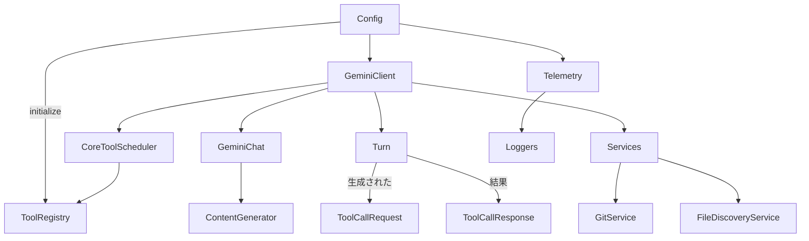

# `packages/core` の構造

このドキュメントでは `packages/core` ディレクトリ配下のソースコード構成と主要ファイルの役割を一覧化します。

## ディレクトリ構成

```text
packages/core/
├─ index.ts          - パッケージのエントリポイント
├─ src/
│  ├─ code_assist/   - OAuth 認証や Code Assist API 通信
│  ├─ config/        - 設定管理
│  ├─ core/          - Gemini との対話ロジック
│  ├─ services/      - 補助サービス (Git/ファイル探索)
│  ├─ telemetry/     - 解析・ログ送信
│  ├─ tools/         - CLI から利用されるツール群
│  └─ utils/         - 共通ユーティリティ
```

## ファイルごとの概要

### code_assist

| ファイル | 役割 |
| --- | --- |
| `codeAssist.ts` | OAuth 認証済みの `CodeAssistServer` を生成し、`ContentGenerator` インターフェースを実装するラッパーを提供します |
| `converter.ts` | Code Assist API と `@google/genai` 型との相互変換処理を担います |
| `oauth2.ts` | ブラウザ連携や Cloud Shell を使った OAuth2 認証を行います |
| `server.ts` | Code Assist REST API へのリクエスト処理クラスです |
| `setup.ts` | ユーザーのプロジェクト ID 検出や Onboard 処理をまとめています |
| `types.ts` | Code Assist で使用するリクエスト/レスポンス型定義 |

### config

| ファイル | 役割 |
| --- | --- |
| `config.ts` | CLI 全体の設定管理クラス。ツール登録やセッション情報、テレメトリ初期化を行います |
| `models.ts` | デフォルトのモデル名定数を定義します |

### core

| ファイル | 役割 |
| --- | --- |
| `client.ts` | `GeminiChat` を用いたメッセージ送受信の中心クラス。履歴管理やモデル切替、圧縮処理を行います |
| `contentGenerator.ts` | `@google/genai` もしくは Code Assist API を利用する際の抽象化レイヤー |
| `coreToolScheduler.ts` | ツール呼び出しのスケジューリング・確認処理を行います |
| `geminiChat.ts` | ストリーミング対応のチャットセッション実装。API 呼び出しのリトライや履歴記録を担当します |
| `geminiRequest.ts` | Gemini API へのリクエスト表現を提供するユーティリティ |
| `logger.ts` | CLI からのメッセージ履歴を JSON ファイルへ記録します |
| `modelCheck.ts` | API キーとモデルの組み合わせ検証を行います |
| `nonInteractiveToolExecutor.ts` | ユーザー確認無しで単一ツールを実行する簡易実装 |
| `prompts.ts` | システムプロンプト生成と埋め込み指示文を保持します |
| `tokenLimits.ts` | モデルごとのトークン上限値を返します |
| `turn.ts` | API 応答を解析し `ToolCallRequest` などのイベントに変換するクラス |

### services

| ファイル | 役割 |
| --- | --- |
| `fileDiscoveryService.ts` | `.gitignore` や `.geminiignore` を考慮したファイルフィルタリング |
| `gitService.ts` | チェックポイント用の内部 Git リポジトリ管理 |

### telemetry

| ファイル | 役割 |
| --- | --- |
| `index.ts` | テレメトリモジュールのエントリーポイント。初期化やイベントログ関数を公開します |
| `loggers.ts` | OpenTelemetry を利用したイベント送信処理 |
| `metrics.ts` | メトリクス名定義と取得支援関数 |
| `sdk.ts` | OpenTelemetry SDK 初期化処理 |
| `types.ts` | ログ/イベント用の型定義 |
| `uiTelemetry.ts` | CLI UI からのイベント送信用ラッパー |
| `constants.ts` | イベント名・メトリクス名の定数定義 |
| `clearcut-logger/*` | Google 内部向け Clearcut 連携コード |

### tools

| ファイル | 役割 |
| --- | --- |
| `tools.ts` | ツールインターフェースおよび `BaseTool` 実装、`ToolResult` 型定義 |
| `tool-registry.ts` | ツール登録・MCP 経由の動的発見を行うレジストリ |
| `read-file.ts` | ファイル読み込みツール |
| `write-file.ts` | ファイル書き込みツール |
| `ls.ts` | ディレクトリ一覧取得ツール |
| `grep.ts` | Grep 検索ツール |
| `glob.ts` | Glob パターン検索ツール |
| `edit.ts` | ファイル編集ツール（差分確認・確認機能あり） |
| `shell.ts` | シェルコマンド実行ツール |
| `web-fetch.ts` | HTTP GET 取得ツール |
| `web-search.ts` | Google 検索ツール |
| `read-many-files.ts` | 複数ファイル読み込み・連結ツール |
| `memoryTool.ts` | `GEMINI.md` への追記を行う記憶ツール |
| `mcp-client.ts` / `mcp-tool.ts` | Model Context Protocol サーバー連携用ツール |
| `modifiable-tool.ts` | 編集可能ツールの共通ロジック |
| `diffOptions.ts` | 差分表示時のオプション定義 |

### utils

| ファイル | 役割 |
| --- | --- |
| `paths.ts` | 各種パス計算・ハッシュ生成ヘルパー |
| `fileUtils.ts` | ファイル読み書き・改行変換等のユーティリティ |
| `bfsFileSearch.ts` | 幅優先探索によるファイル検索 |
| `gitIgnoreParser.ts` | `.gitignore` 形式の解析クラス |
| `gitUtils.ts` | Git リポジトリ判定等のヘルパー |
| `memoryDiscovery.ts` | 階層的に `GEMINI.md` を探索・結合する処理 |
| `memoryImportProcessor.ts` | `@file.md` インポート構文の展開ロジック |
| `generateContentResponseUtilities.ts` | API レスポンスからテキスト抽出等 |
| `errorReporting.ts` | エラー内容を Gemeni モデルに送信する補助 |
| `errors.ts` | 共通エラー型や整形関数 |
| `retry.ts` | 429/5xx 対応のリトライ処理 |
| `fetch.ts` | 安全な fetch ラッパー |
| `editor.ts` | エディタ起動ロジック (VSCode 等) |
| `editCorrector.ts` | EditTool 用の補正ロジック |
| `messageInspectors.ts` | LLM 応答の検査・フィルタリング |
| `nextSpeakerChecker.ts` | 会話継続の必要性を判定するユーティリティ |
| `session.ts` | セッション ID 生成保持 |
| `quotaErrorDetection.ts` | クォータ超過エラーの検出関数群 |
| `summarizer.ts` | 長いテキストの要約処理 |
| `LruCache.ts` | 単純な LRU キャッシュ実装 |
| `user_account.ts` / `user_id.ts` | OAuth 認証情報の保存と識別子生成 |
| `schemaValidator.ts` | JSON Schema バリデーション簡易ラッパー |
| `bfsFileSearch.ts` | ディレクトリ探索ユーティリティ |
| `testUtils.ts` | テスト用補助関数 |

## 関係図

以下は主要コンポーネントの依存関係を簡略化して示したものです。



各矢印はクラス間の主な利用関係を表します。詳細な依存は省略していますが、`GeminiClient` が会話管理の中心であり、`CoreToolScheduler` がツール実行の調停を行う構造になっています。

