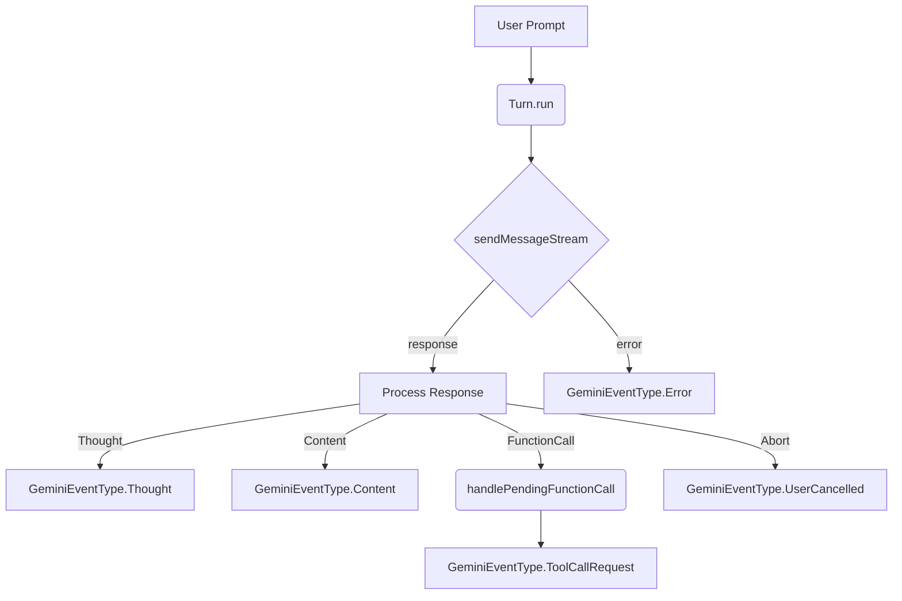

# `turn.ts` 詳細解説

このドキュメントでは `packages/core/src/core/turn.ts` のコードについて、一行ごとの挙動と全体の役割を説明します。Gemini CLI のやり取りを管理する中心的なクラス `Turn` の内部処理を理解するための資料です。

## ファイル内での役割

`Turn` クラスは、Gemini モデルとの会話で 1 ターン（1 回の送信とその応答）を処理します。ユーザーからの入力を受け取って API へ送り、得られたストリームを解析し、ツール呼び出しやテキスト出力などのイベントへ変換します。また、エラー処理やユーザーキャンセル、デバッグ用情報の保存も行います。

## クラス間の関係図

## 行ごとの解説

- **L001** `/**` - コメント開始
- **L002** ` * @license` - コメント行
- **L003** ` * Copyright 2025 Google LLC` - コメント行
- **L004** ` * SPDX-License-Identifier: Apache-2.0` - コメント行
- **L005** ` */` - コメント終了
- **L006** `` - 空行
- **L007** `import {` - インポート文
- **L008** `  PartListUnion,` - コード
- **L009** `  GenerateContentResponse,` - コード
- **L010** `  FunctionCall,` - コード
- **L011** `  FunctionDeclaration,` - コード
- **L012** `} from '@google/genai';` - ブロック終了
- **L013** `import {` - インポート文
- **L014** `  ToolCallConfirmationDetails,` - コード
- **L015** `  ToolResult,` - コード
- **L016** `  ToolResultDisplay,` - コード
- **L017** `} from '../tools/tools.js';` - ブロック終了
- **L018** `import { getResponseText } from '../utils/generateContentResponseUtilities.js';` - インポート文
- **L019** `import { reportError } from '../utils/errorReporting.js';` - インポート文
- **L020** `import {` - インポート文
- **L021** `  getErrorMessage,` - コード
- **L022** `  UnauthorizedError,` - コード
- **L023** `  toFriendlyError,` - コード
- **L024** `} from '../utils/errors.js';` - ブロック終了
- **L025** `import { GeminiChat } from './geminiChat.js';` - インポート文
- **L026** `` - 空行
- **L027** `Define a structure for tools passed to the server` - コメント: Define a structure for tools passed to the server
- **L028** `export interface ServerTool {` - インターフェース定義
- **L029** `  name: string;` - コード
- **L030** `  schema: FunctionDeclaration;` - コード
- **L031** `The execute method signature might differ slightly or be wrapped` - コメント: The execute method signature might differ slightly or be wrapped
- **L032** `  execute(` - コード
- **L033** `    params: Record<string, unknown>,` - コード
- **L034** `    signal?: AbortSignal,` - コード
- **L035** `  ): Promise<ToolResult>;` - コード
- **L036** `  shouldConfirmExecute(` - コード
- **L037** `    params: Record<string, unknown>,` - コード
- **L038** `    abortSignal: AbortSignal,` - コード
- **L039** `  ): Promise<ToolCallConfirmationDetails | false>;` - コード
- **L040** `}` - ブロック終了
- **L041** `` - 空行
- **L042** `export enum GeminiEventType {` - 列挙型定義
- **L043** `  Content = 'content',` - コード
- **L044** `  ToolCallRequest = 'tool_call_request',` - コード
- **L045** `  ToolCallResponse = 'tool_call_response',` - コード
- **L046** `  ToolCallConfirmation = 'tool_call_confirmation',` - コード
- **L047** `  UserCancelled = 'user_cancelled',` - コード
- **L048** `  Error = 'error',` - コード
- **L049** `  ChatCompressed = 'chat_compressed',` - コード
- **L050** `  Thought = 'thought',` - コード
- **L051** `  MaxSessionTurns = 'max_session_turns',` - コード
- **L052** `  LoopDetected = 'loop_detected',` - コード
- **L053** `}` - ブロック終了
- **L054** `` - 空行
- **L055** `export interface StructuredError {` - インターフェース定義
- **L056** `  message: string;` - コード
- **L057** `  status?: number;` - コード
- **L058** `}` - ブロック終了
- **L059** `` - 空行
- **L060** `export interface GeminiErrorEventValue {` - インターフェース定義
- **L061** `  error: StructuredError;` - コード
- **L062** `}` - ブロック終了
- **L063** `` - 空行
- **L064** `export interface ToolCallRequestInfo {` - インターフェース定義
- **L065** `  callId: string;` - コード
- **L066** `  name: string;` - コード
- **L067** `  args: Record<string, unknown>;` - コード
- **L068** `  isClientInitiated: boolean;` - コード
- **L069** `  prompt_id: string;` - コード
- **L070** `}` - ブロック終了
- **L071** `` - 空行
- **L072** `export interface ToolCallResponseInfo {` - インターフェース定義
- **L073** `  callId: string;` - コード
- **L074** `  responseParts: PartListUnion;` - コード
- **L075** `  resultDisplay: ToolResultDisplay | undefined;` - コード
- **L076** `  error: Error | undefined;` - コード
- **L077** `}` - ブロック終了
- **L078** `` - 空行
- **L079** `export interface ServerToolCallConfirmationDetails {` - インターフェース定義
- **L080** `  request: ToolCallRequestInfo;` - コード
- **L081** `  details: ToolCallConfirmationDetails;` - コード
- **L082** `}` - ブロック終了
- **L083** `` - 空行
- **L084** `export type ThoughtSummary = {` - 型エイリアス定義
- **L085** `  subject: string;` - コード
- **L086** `  description: string;` - コード
- **L087** `};` - ブロック終了
- **L088** `` - 空行
- **L089** `export type ServerGeminiContentEvent = {` - 型エイリアス定義
- **L090** `  type: GeminiEventType.Content;` - コード
- **L091** `  value: string;` - コード
- **L092** `};` - ブロック終了
- **L093** `` - 空行
- **L094** `export type ServerGeminiThoughtEvent = {` - 型エイリアス定義
- **L095** `  type: GeminiEventType.Thought;` - コード
- **L096** `  value: ThoughtSummary;` - コード
- **L097** `};` - ブロック終了
- **L098** `` - 空行
- **L099** `export type ServerGeminiToolCallRequestEvent = {` - 型エイリアス定義
- **L100** `  type: GeminiEventType.ToolCallRequest;` - コード
- **L101** `  value: ToolCallRequestInfo;` - コード
- **L102** `};` - ブロック終了
- **L103** `` - 空行
- **L104** `export type ServerGeminiToolCallResponseEvent = {` - 型エイリアス定義
- **L105** `  type: GeminiEventType.ToolCallResponse;` - コード
- **L106** `  value: ToolCallResponseInfo;` - コード
- **L107** `};` - ブロック終了
- **L108** `` - 空行
- **L109** `export type ServerGeminiToolCallConfirmationEvent = {` - 型エイリアス定義
- **L110** `  type: GeminiEventType.ToolCallConfirmation;` - コード
- **L111** `  value: ServerToolCallConfirmationDetails;` - コード
- **L112** `};` - ブロック終了
- **L113** `` - 空行
- **L114** `export type ServerGeminiUserCancelledEvent = {` - 型エイリアス定義
- **L115** `  type: GeminiEventType.UserCancelled;` - コード
- **L116** `};` - ブロック終了
- **L117** `` - 空行
- **L118** `export type ServerGeminiErrorEvent = {` - 型エイリアス定義
- **L119** `  type: GeminiEventType.Error;` - コード
- **L120** `  value: GeminiErrorEventValue;` - コード
- **L121** `};` - ブロック終了
- **L122** `` - 空行
- **L123** `export interface ChatCompressionInfo {` - インターフェース定義
- **L124** `  originalTokenCount: number;` - コード
- **L125** `  newTokenCount: number;` - コード
- **L126** `}` - ブロック終了
- **L127** `` - 空行
- **L128** `export type ServerGeminiChatCompressedEvent = {` - 型エイリアス定義
- **L129** `  type: GeminiEventType.ChatCompressed;` - コード
- **L130** `  value: ChatCompressionInfo | null;` - コード
- **L131** `};` - ブロック終了
- **L132** `` - 空行
- **L133** `export type ServerGeminiMaxSessionTurnsEvent = {` - 型エイリアス定義
- **L134** `  type: GeminiEventType.MaxSessionTurns;` - コード
- **L135** `};` - ブロック終了
- **L136** `` - 空行
- **L137** `export type ServerGeminiLoopDetectedEvent = {` - 型エイリアス定義
- **L138** `  type: GeminiEventType.LoopDetected;` - コード
- **L139** `};` - ブロック終了
- **L140** `` - 空行
- **L141** `The original union type, now composed of the individual types` - コメント: The original union type, now composed of the individual types
- **L142** `export type ServerGeminiStreamEvent =` - 型エイリアス定義
- **L143** `  | ServerGeminiContentEvent` - コード
- **L144** `  | ServerGeminiToolCallRequestEvent` - コード
- **L145** `  | ServerGeminiToolCallResponseEvent` - コード
- **L146** `  | ServerGeminiToolCallConfirmationEvent` - コード
- **L147** `  | ServerGeminiUserCancelledEvent` - コード
- **L148** `  | ServerGeminiErrorEvent` - コード
- **L149** `  | ServerGeminiChatCompressedEvent` - コード
- **L150** `  | ServerGeminiThoughtEvent` - コード
- **L151** `  | ServerGeminiMaxSessionTurnsEvent` - コード
- **L152** `  | ServerGeminiLoopDetectedEvent;` - コード
- **L153** `` - 空行
- **L154** `A turn manages the agentic loop turn within the server context.` - コメント: A turn manages the agentic loop turn within the server context.
- **L155** `export class Turn {` - クラス定義開始
- **L156** `  readonly pendingToolCalls: ToolCallRequestInfo[];` - コード
- **L157** `  private debugResponses: GenerateContentResponse[];` - コード
- **L158** `` - 空行
- **L159** `  constructor(` - コンストラクタ定義
- **L160** `    private readonly chat: GeminiChat,` - コード
- **L161** `    private readonly prompt_id: string,` - コード
- **L162** `  ) {` - コード
- **L163** `    this.pendingToolCalls = [];` - コード
- **L164** `    this.debugResponses = [];` - コード
- **L165** `  }` - ブロック終了
- **L166** `The run method yields simpler events suitable for server logic` - コメント: The run method yields simpler events suitable for server logic
- **L167** `  async *run(` - runメソッド開始
- **L168** `    req: PartListUnion,` - コード
- **L169** `    signal: AbortSignal,` - コード
- **L170** `  ): AsyncGenerator<ServerGeminiStreamEvent> {` - コード
- **L171** `    try {` - コード
- **L172** `      const responseStream = await this.chat.sendMessageStream(` - コード
- **L173** `        {` - コード
- **L174** `          message: req,` - コード
- **L175** `          config: {` - コード
- **L176** `            abortSignal: signal,` - コード
- **L177** `          },` - ブロック終了
- **L178** `        },` - ブロック終了
- **L179** `        this.prompt_id,` - コード
- **L180** `      );` - コード
- **L181** `` - 空行
- **L182** `      for await (const resp of responseStream) {` - コード
- **L183** `        if (signal?.aborted) {` - コード
- **L184** `          yield { type: GeminiEventType.UserCancelled };` - コード
- **L185** `Do not add resp to debugResponses if aborted before processing` - コメント: Do not add resp to debugResponses if aborted before processing
- **L186** `          return;` - コード
- **L187** `        }` - ブロック終了
- **L188** `        this.debugResponses.push(resp);` - コード
- **L189** `` - 空行
- **L190** `        const thoughtPart = resp.candidates?.[0]?.content?.parts?.[0];` - コード
- **L191** `        if (thoughtPart?.thought) {` - コード
- **L192** `Thought always has a bold "subject" part enclosed in double asterisks` - コメント: Thought always has a bold "subject" part enclosed in double asterisks
- **L193** `(e.g., **Subject**). The rest of the string is considered the description.` - コメント: (e.g., **Subject**). The rest of the string is considered the description.
- **L194** `          const rawText = thoughtPart.text ?? '';` - コード
- **L195** `          const subjectStringMatches = rawText.match(/\*\*(.*?)\*\*/s);` - コード
- **L196** `          const subject = subjectStringMatches` - コード
- **L197** `            ? subjectStringMatches[1].trim()` - コード
- **L198** `            : '';` - コード
- **L199** `          const description = rawText.replace(/\*\*(.*?)\*\*/s, '').trim();` - コード
- **L200** `          const thought: ThoughtSummary = {` - コード
- **L201** `            subject,` - コード
- **L202** `            description,` - コード
- **L203** `          };` - ブロック終了
- **L204** `` - 空行
- **L205** `          yield {` - コード
- **L206** `            type: GeminiEventType.Thought,` - コード
- **L207** `            value: thought,` - コード
- **L208** `          };` - ブロック終了
- **L209** `          continue;` - コード
- **L210** `        }` - ブロック終了
- **L211** `` - 空行
- **L212** `        const text = getResponseText(resp);` - コード
- **L213** `        if (text) {` - コード
- **L214** `          yield { type: GeminiEventType.Content, value: text };` - コード
- **L215** `        }` - ブロック終了
- **L216** `` - 空行
- **L217** `Handle function calls (requesting tool execution)` - コメント: Handle function calls (requesting tool execution)
- **L218** `        const functionCalls = resp.functionCalls ?? [];` - コード
- **L219** `        for (const fnCall of functionCalls) {` - コード
- **L220** `          const event = this.handlePendingFunctionCall(fnCall);` - コード
- **L221** `          if (event) {` - コード
- **L222** `            yield event;` - コード
- **L223** `          }` - ブロック終了
- **L224** `        }` - ブロック終了
- **L225** `      }` - ブロック終了
- **L226** `    } catch (e) {` - ブロック終了
- **L227** `      const error = toFriendlyError(e);` - コード
- **L228** `      if (error instanceof UnauthorizedError) {` - コード
- **L229** `        throw error;` - コード
- **L230** `      }` - ブロック終了
- **L231** `      if (signal.aborted) {` - コード
- **L232** `        yield { type: GeminiEventType.UserCancelled };` - コード
- **L233** `Regular cancellation error, fail gracefully.` - コメント: Regular cancellation error, fail gracefully.
- **L234** `        return;` - コード
- **L235** `      }` - ブロック終了
- **L236** `` - 空行
- **L237** `      const contextForReport = [...this.chat.getHistory(/*curated*/ true), req];` - コード
- **L238** `      await reportError(` - コード
- **L239** `        error,` - コード
- **L240** `        'Error when talking to Gemini API',` - コード
- **L241** `        contextForReport,` - コード
- **L242** `        'Turn.run-sendMessageStream',` - コード
- **L243** `      );` - コード
- **L244** `      const status =` - コード
- **L245** `        typeof error === 'object' &&` - コード
- **L246** `        error !== null &&` - コード
- **L247** `        'status' in error &&` - コード
- **L248** `        typeof (error as { status: unknown }).status === 'number'` - コード
- **L249** `          ? (error as { status: number }).status` - コード
- **L250** `          : undefined;` - コード
- **L251** `      const structuredError: StructuredError = {` - コード
- **L252** `        message: getErrorMessage(error),` - コード
- **L253** `        status,` - コード
- **L254** `      };` - ブロック終了
- **L255** `      yield { type: GeminiEventType.Error, value: { error: structuredError } };` - コード
- **L256** `      return;` - コード
- **L257** `    }` - ブロック終了
- **L258** `  }` - ブロック終了
- **L259** `` - 空行
- **L260** `  private handlePendingFunctionCall(` - handlePendingFunctionCallメソッド開始
- **L261** `    fnCall: FunctionCall,` - コード
- **L262** `  ): ServerGeminiStreamEvent | null {` - コード
- **L263** `    const callId =` - コード
- **L264** `      fnCall.id ??` - コード
- **L265** `      `${fnCall.name}-${Date.now()}-${Math.random().toString(16).slice(2)}`;` - コード
- **L266** `    const name = fnCall.name || 'undefined_tool_name';` - コード
- **L267** `    const args = (fnCall.args || {}) as Record<string, unknown>;` - コード
- **L268** `` - 空行
- **L269** `    const toolCallRequest: ToolCallRequestInfo = {` - コード
- **L270** `      callId,` - コード
- **L271** `      name,` - コード
- **L272** `      args,` - コード
- **L273** `      isClientInitiated: false,` - コード
- **L274** `      prompt_id: this.prompt_id,` - コード
- **L275** `    };` - ブロック終了
- **L276** `` - 空行
- **L277** `    this.pendingToolCalls.push(toolCallRequest);` - コード
- **L278** `` - 空行
- **L279** `Yield a request for the tool call, not the pending/confirming status` - コメント: Yield a request for the tool call, not the pending/confirming status
- **L280** `    return { type: GeminiEventType.ToolCallRequest, value: toolCallRequest };` - コード
- **L281** `  }` - ブロック終了
- **L282** `` - 空行
- **L283** `  getDebugResponses(): GenerateContentResponse[] {` - getDebugResponsesメソッド開始
- **L284** `    return this.debugResponses;` - コード
- **L285** `  }` - ブロック終了
- **L286** `}` - ブロック終了
